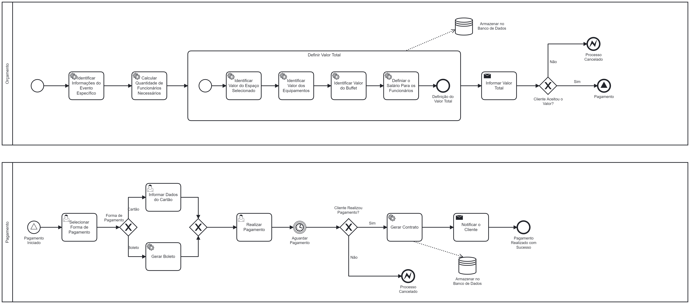
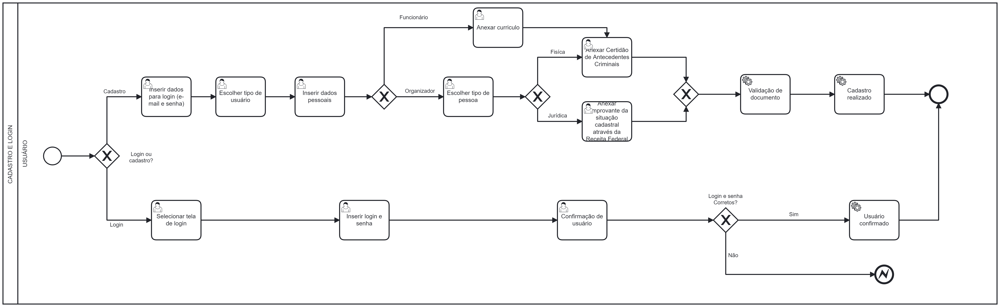

# BestEvents

**Gabriel Estevão Nogueira Sobrinho**, gabriel.sobrinho@sga.pucminas.br

**Diego Machado Cordeiro**, diego.cordeiro@sga.pucminas.br

**João Gabriel Perez Monteiro**, jgpmonteiro@sga.pucminas.br

**Gustavo Henrique de Lima e Silva**, ghlsilva@sga.pucminas.br

**Kaike Batista Dassumpção**, kaike.batista@sga.pucminas.br

**Vinicius Gonzaga Guilherme**, vgguilherme@sga.pucminas.br

---

Professores:

**Hugo Bastos de Paula**

**Felipe Augusto Lima Reis**

**Cleiton Silva Tavares**

---

_Curso de Engenharia de Software, Unidade Praça da Liberdade_

_Instituto de Informática e Ciências Exatas – Pontifícia Universidade de Minas Gerais (PUC MINAS), Belo Horizonte – MG – Brasil_

---

_ Esse trabalho se baseia na criação de um sistema que permita com que o usuário possa ter auxilio para a organização de um evento, como orçamento, escolha de data e contratação de funcionários. _

---

## 1. Introdução

  **Planejamento** e **organização** são a chave para elaborar um evento de sucesso, mas também são uma faca de dois gumes. Já que pode trazer um retorno totalmente satisfatório para o produtor, assim como pode se tornar inesquecível pela falta de organização e prejuízos trazidos.  
  Esse contexto criou a BestEvents, que busca uma forma de facilitar o agendamento de locais para qualquer evento que seja, com atenção aos detalhes,fazendo uso de ferramentas e estratégias que geram resultado positivos. Portanto, com a BestEvents será possível planejar orçamentos,acompanhar as etapas e supervisionar todo evento para que não aconteça nenhum imprevisto, assim podendo organizar atividades de lazer, entretenimento, eventos esportivos e até mesmo culturais.

    1.1 Contextualização

 A aplicação deseja facilitar a organização dos eventos pois planejar algo é estressante. São várias variáveis a se pensar para que ocorra
 tudo certo e não é difícil de se esquecer de algo,colocando todo o evento em risco.
 De acordo com a Associação Brasileira de Promotores de Eventos (Abrape), a expectativa é de que 590 mil eventos sejam realizados até o final deste ano,
 em todo país[1.1]. Responsável por 4,32% do Produto Interno Bruto (PIB) nacional[1.1], o setor amargou prejuízos nos dois últimos anos, devido a pandemia do vírus
 Covid-19. A aplicação reconhece a importância desse mercado que movimenta milhares de pessoas e planeja colaborar com diversas criações de eventos
 para todo público.
 
 
    1.2 Problema

 Abalados pela pandemia da covid-19,estima-se que as medidas restritivas impactaram negativamente cerca de 97% das empresas do setor de eventos,que deixaram de 
faturar ao menos 230 bilhões de reais em 2020 e 2021,segundo a Abrape[1.3]. Muitos eventos foram cancelados e isso afetou as empresas,produtores,músicos,garçons,
seguranças,fornecedores e vários profissionais que movimentam o mercado. Apesar de algumas leis que criaram ações emergencias,para muitas empresas não deu tempo
de esperar pelo socorro. Estima-se que um terço tenha deixado de existir meio a crise.[1.3]
 Graças ao avanço na vacinação,o setor que foi um dos primeiros a parar na pandemia está retornando lentamente e em alguns casos com medidas de seguranças e seguindo
 protocolos.
 

    1.3 Objetivo geral

Elaborar um site em que as pessoas ou empresas possam planejar, criar, organizar, produzir e gerir os eventos, buscando gerar resultados positivos com maior simplicidade.
   
   
    1.3.1 Objetivos específicos

-Aumentar o lucro para criadores de eventos

-Contrubuir com aumento do fluxo de pessoas.

    1.4 Justificativas

O Brasil é considerado um país bastante festivo  e com isso a empresa BestEvents deseja entrar para o mercado corporativo para que possam ser realizados diversos eventos com um bom custo-benefício e satisfação do cliente. Assim a empresa colaborará com a volta de eventos após a pandemia causada pelo vírus da covid-19.

## 2. Participantes do processo

**StakeHolders**
1. Principais: Clientes de todas as idades de classe alta/média que possuam condição de bancar o evento. Empresas de qualquer porte que desejam uma forma fácil de planejar o evento. Investidores que desejam fazer grandes eventos com intenção de lucro.  
1. Secundários: Fornecedores para o evento, donos de locais para eventos.  
1. Terciario: Trabalhadores(garçons,funcionários para limpeza,assistência médica e de segurança,funcionários para alimentação,recepção,fotografia,entretenimento e entre outros funcionários requisitados para a relização de um evento específico),donos de locais para eventos,convidados, pagantes.

---
**Mapa dos StakeHolders**

## 3. Modelagem do processo de negócio

## 3.1. Análise da situação atual

A organização de eventos inclui várias etapas, como planejamento, divulgação, vendas, execução e análise.   Para pessoas que não possuem experiência em gestão de eventos, a chance de criarem um evento sem imprevistos é muito baixa. Principalmente com o surgimento da Covid-19 que devido ao isolamento cancelou vários eventos e atrações, dificultou muito a relação organizador-contratante, com isso, a solitação de prestação de serviços ficou cada vez mais dificil já que existem poucas ferramentas que facilitam esses processos. Atualmente há várias empresas do ramo de eventos encontradas no google, como exemplo: “Inteegra”, “Vivuseventos” e “Abrafesta”. No entanto, o modelo de negócio dessas empresas, na maioria das vezes, não é o mesmo a ser feito pela BestEvents. 

## 3.2. Descrição Geral da proposta

**0. CADASTRO DE LOCAL:**

A BestEvents permite que pessoas possam cadastrar locais para que sejam utilizados em eventos de outras pessoas, afim de um retorno monetário.

**1. SOLICITAÇÃO DE EVENTO:**

Ao acessar a página da BestEvents será a primeira opção para o usuário, onde ele começará a organização de um evento de acordo com o tipo selecionado e depois que ele entrar em sua conta ou se cadastrar.

**2. CADASTRO E LOGIN DO USUÁRIO:**

A tela inicial que será exibida para o cliente, que permite seu acesso à aplicação (quando já cadastrado) ou também sua forma de ingresso, que possibilita a identificação de quais recursos o usuário pretende utilizar durante seu uso na aplicação.

**3. DEFINIÇÃO DO ESPAÇO E NÚMERO DE PESSOAS:**

O cliente selecionará um local já cadastrado no sistema da BestEvents ou poderá optar por utilizar um espaço próprio, ainda não cadastrado no sistema, neste caso será necessário que o usuário informe o tamanho do local onde ocorrerá o evento, além de sua localização. Após isso, o usuário informará o número de pessoas esperadas para o evento em específico, e essa informação por sua vez será armazenada no banco de dados.

**4. SELEÇÃO DE EQUIPAMENTOS:**

Neste processo o clinte poderá escolher diversos tipos de equipamentos para melhorar a experiência de seu evento. Poderá selecionar mais de um equipamento por tipo.

**5. DEFINIÇÃO DO BUFFET E DATA:**

Usuário poderá decidir se deseja a organização do Buffet, ou se ele resolverá isso por conta própria. Se optar pelos serviços da BestEvents, poderá escolher dentre as opções de empresas parceiras produtoras de Buffet e definirá o cardápio de seu evento. No final do processo deverá definir a data que ocorrerá seu evento.

**6. ORÇAMENTO E PAGAMENTO:**

Ao final de toda descrição do evento por parte do cliente para o nosso sistema, será calculado automaticamente, a partir dos dados em nosso banco de dados, o valor total que deverá ser pago. O usuário poderá escolher a melhor forma de pagamento para ele. Também será gerado um contrato virtual que deverá ser assinado pelo cliente, para evitar que o evento seja cancelado em cima da hora, superlotação, entre outros transtornos, além de oficializar a prestação de serviços da BestEvents.

**7. GESTÃO DE FUNCIONÁRIOS:**

Terá uma página com informações de eventos que irão ocorrer,assim uma pessoa já logada no site poderá escolher um evento que tenha interesse e escolher a área que deseja atuar e selecionar uma vaga disponível, com isso poderá enviar o currículo que será analisado pelo cliente organizador do evento na BestEvents.

<!--

**2. CADASTRO E LOGIN DO USUÁRIO:**
A tela inicial que será exibida para o cliente, que permite seu acesso à aplicação (quando já cadastrado) ou também sua forma de ingresso, que possibilita a identificação de quais recursos o usuário pretende utilizar durante seu uso na aplicação.

**3. SELECIONAR NÚMERO DE PESSOAS E DATA:** 
O cliente logado informará a quantidade desejada e o sistema verificará se há locais que comportam esse número. Além disso, será perguntado ao usuário se há pessoas com mobilidade reduzida entre os possíveis convidados. Em seguida, o cliente escolherá a data e o sistema verificará novamente se há disponibilidade de locais para esses dias, se sim, o processo será concluído.

**3. TIPO DO EVENTO / ESCOLHA DE ESPAÇO:** 
O sistema apresenta ao usuário, os tipos de evento com os quais a Best Events trabalha.
Caso não haja o tipo de evento de interesse do usuário o processo é finalizado. Caso haja o tipo de evento do interesse do usuário, o mesmo selecionará o evento
e logo em seguida o sistema armazenará essa informação. Em seguida o sistema apresentará ao usuário os espaços disponíveis para realização de eventos.
Em seguida, o usuário seleciona o espaço desejado, podendo escolher mais de um espaço do mesmo tipo ou de tipos diferentes. Após isso, o sistema verificará se o(s) espaço(s) está disponível para aquele tipo de evento específico. Se sim o(s) espaço(s) é reservado(s), se não o sistema da opção de alterar alguma informação no evento ou na escolha de espaço, ou cancelar o processo.

**4. SELEÇÃO DE EQUIPAMENTOS:**

**5. ORÇAMENTO E PAGAMENTO:**
Ao final de toda descrição do evento por parte do cliente para o nosso sistema, será calculado automaticamente, a partir dos dados em nosso banco de dados, o valor total que deverá ser pago. O usuário poderá escolher a melhor forma de pagamento para ele. Também será gerado um contrato virtual que deverá ser assinado pelo cliente, para evitar que o evento seja cancelado em cima da hora, superlotação, entre outros transtornos, além de oficializar a prestação de serviços da BestEvents.

**6. Selecionar funcionários para evento:** 
Terá uma página com informações de eventos que irão ocorrer,assim uma pessoa já logada no site poderá escolher um evento que tenha interesse e escolher a área que deseja atuar e selecionar uma vaga disponível, com isso poderá enviar o currículo que será analisado pelo cliente organizador do evento na BestEvents.

-->

## 3.3. Modelagem dos Processos

### 3.3.0 Processo 0 - CADASTRO DO LOCAL

### 3.3.1 Processo 1 – SOLICITAÇÃO DO EVENTO

### 3.3.2 Processo 2 - CADASTRO E LOGIN DO USUÁRIO

### 3.3.3 Processo 3 - DESCRIÇÃO DO ESPACO E INFORMAR NÚMERO DE PESSOAS

### 3.3.4 Processo 4 - SELEÇÃO DE EQUIPAMENTOS

### 3.3.5 Processo 5 - INFORMAÇÃO SOBRE O BUFFET E DATA

### 3.3.6 Processo 6 - ORÇAMENTO E PAGAMENTO

### 3.3.7 Processo 7 - CADASTRO E SELEÇÃO DE FUNCIONÁRIOS

<!--
### 3.3.1 Processo 1 – CADASTRO E LOGIN DO USUÁRIO

### 3.3.2 Processo 2 – SELECIONAR NÚMERO DE PESSOAS E DATA:
Este processo mostra como será a seleção da quantidade de pessoas e a data do evento.

### 3.3.3 Processo 3 – TIPO DO EVENTO E ESCOLHA DE ESPAÇO:

Este processo apresenta como sera feita a escolha do evento de interesse do usuario e a seleção do espaço onde acontecerá o evento.

### 3.3.4 Processo 4 – SELEÇÃO DE EQUIPAMENTOS

O processo descrito mostra como funcionará a seleção dos equipamentos desejados do usuário.

### 3.3.5 Processo 5 – ORÇAMENTO E PAGAMENTO

Este processo demonstra como será feito o orçamento do evento para o cliente, e também como será feito o pagamento.

### 3.3.6 Processo 6 – Banco de Talentos e Seleção de Funcionários para o Evento

Este processo possibilita que uma pessoa se torne funcionário da empresa

## 3.4 Processo Completo

-->

## 4. Projeto da Solução

### 4.1. Detalhamento das atividades

<!-- Descrever aqui cada uma das propriedades das atividades de cada um dos processos. Devem estar relacionadas com o modelo de processo apresentado anteriormente. -->
#### Processo 0 - Cadastro de Local

**Inserir Informações do Local**

| **Campo** | **Tipo** | **Restrições** | **Valor default** |
| --- | --- | --- | --- |
| Nome | Caixa de texto | Não nulo |  |
| Estado | select | UF válido |  |
| Cidade | select | Não nulo |  |
| Rua | Caixa de texto | Não nulo |  |
| Número de Endereço | Caixa de texto | Não nulo |  |
| Capacidade | Única Escolha | Não nulo | "10-20" |
| Valor | Caixa de texto | Não nulo | 0,00 |
| Data Disponível | Data | Não nulo |  |

#### Processo 1 - Solicitação de um Evento

**Selecionar o Tipo do Evento**
| **Campo** | **Tipo** | **Restrições** | **Valor default** |
| --- | --- | --- | --- |
| Tipo de Evento | Seleção Única | Não nulo |  |

#### Processo 2 – Cadastro e Login de usuário

**Inserir dados do usuário**

| **Campo** | **Tipo** | **Restrições** | **Valor default** |
| --- | --- | --- | --- |
| Nome | Caixa de texto |  |  |
| E-mail | Caixa de texto | Formato de e-mail |  |
| Senha | Caixa de texto | Mínimo 8 caracteres  |  |

**Seleção tipo de usuário**

| **Campo** | **Tipo** | **Restrições** | **Valor default** |
| --- | --- | --- | --- |
| Fornecedor | Seleção única |  |  |
| Organizador | Seleção única |  |  |
| Funcionário | Seleção única |  |  |

**Dados pessoais**

| **Campo** | **Tipo** | **Restrições** | **Valor default** |
| --- | --- | --- | --- |
| Foto | Imagem | PNG,JPEG,JPG |  |
| Nome Completo | Caixa de texto |  |  |
| E-mail | Caixa de texto |  |  |
| DDD | Número | |  |
| Telefone | Número | |  |
| Sexo | Seleção única |  |  |
| Currículo | Arquivo | PDF,DOC,DOCX  |  |

**Inserção de informações sobre o local**

| **Campo** | **Tipo** | **Restrições** | **Valor default** |
| --- | --- | --- | --- |
| Foto | Imagem | PNG,JPEG,JPG |  |
| Nome do Local | Caixa de texto |  |  |
| Endereço | Caixa de texto |  |  |
| DDD | Número | |  |
| Telefone | Número | |  |
| Custo | Número | Valor monetário  |  |
| Descrição | Caixa de texto |  |  |

**Seleção tipo de pessoa**

| **Campo** | **Tipo** | **Restrições** | **Valor default** |
| --- | --- | --- | --- |
| Jurídica | Seleção única |  |  |
| Fisíca | Seleção única |  |  |

**Anexo de Antecedentes Criminais**

| **Campo** | **Tipo** | **Restrições** | **Valor default** |
| --- | --- | --- | --- |
| Certidão de Antecedentes Criminais | Arquivo | PDF,PNG,JPG,JPEG  |  |

**Anexo de Situação Cadastral**

| **Campo** | **Tipo** | **Restrições** | **Valor default** |
| --- | --- | --- | --- |
| Situação Cadastral | Arquivo | PDF,PNG,JPG,JPEG  |  |

**Inserir login e senha**

| **Campo** | **Tipo** | **Restrições** | **Valor default** |
| --- | --- | --- | --- |
| Login | Caixa de Texto | formato de e-mail |  |
| Senha | Caixa de Texto | mínimo de 8 caracteres |   |

<!-- 
#### Processo 2 – Selecionar número de pessoas e data

**Informar o número de pessoas**

| **Campo** | **Tipo** | **Restrições** | **Valor default** |
| --- | --- | --- | --- |
| Quantidade de pessoas | Número | Entre 0 e 999999|  |

**Informar se há pessoas com mobilidade reduzida**

| **Campo** | **Tipo** | **Restrições** | **Valor default** |
| --- | --- | --- | --- |
| Haverá pessoas com mobilidade reduzida| Radio |  |  |
| Não haverá pessoas com mobilidade reduzida| Radio |  |  |
| Confirmar | Button | 1 radio selecionado |  |

**Escolher data**

| **Campo** | **Tipo** | **Restrições** | **Valor default** |
| --- | --- | --- | --- |
| Seleção da data| Data | Dia: 1 a 31/ Mês: 1 a 12 |  |
 -->

#### Processo 3 – Descrição do Espaço e Informar Número de Pessoas:

**Descrição do Espaço**

| **Campo** | **Tipo** | **Restrições** | **Valor default** |
| --- | --- | --- | --- |
| Seleçiona espaço desejado | Unica escolha | Pode selecionar um unico local por evento | locais pre-cadastrados, local do usuario |
| Passa informações do local | Tipo numero | apenas valores numericos | Dimensões do espaço |
| Passa informações do local | Caixa de texto | none | Localização |

**Informar numero de pessoas**
| **Campo** | **Tipo** | **Restrições** | **Valor default** |
| --- | --- | --- | --- |
| Informa numero de pessoas | Tipo numero | Entre 1 a 1000 | none |

### Processo 4 - Seleção de Equipamentos

#### Processo 5 - Informação sobre o Buffet e Data
**Decidir buffet**

| **Campo** | **Tipo** | **Restrições** | **Valor default** |
| --- | --- | --- | --- |
| Desejo buffet | única escolha |  |  |
| Não desejo buffet| única escolha |  |  |

 
 **Escolher um dos buffets parceiros**
| **Campo** | **Tipo** | **Restrições** | **Valor default** |
| --- | --- | --- | --- |
| Escolha um buffet | única escolha |  |  |

**Selecionar opções de comida e bebida**
| **Campo** | **Tipo** | **Restrições** | **Valor default** |
| --- | --- | --- | --- |
| Comidas | múltipla escolha |  |  |
| Bebidas | múltipla escolha |  |  |

<!-- 
**Selecionar Locais Desejados**
| Campo | Tipo | Restrições | Valor Defaut |
| ----- | ---- | ---------- | ------------ |
| Salão | CheckBox | none | Unchecked |
| Sala | CheckBox | none | Unchecked |
| Auditório | CheckBox | none | Unchecked |
| Restaurante | CheckBox | none | Unchecked |
| Confirmar | Button | Pelo menos 1 Campo CheckBox Selecionado | none |

**Selecionar Opção de Buffet**
| Campo | Tipo | Restrições | Valor Defaut |
| ----- | ---- | ---------- | ------------ |
| Desejo Buffet | Radio | none | Unchecked |
| Não Desejo Buffet | Radio | none | Unchecked |
| Confirmar | Button | Pelo menos 1 Campo Radio Selecionado | none |

**Selecionar Opção de Funcionários**
| Campo | Tipo | Restrições | Valor Defaut |
| ----- | ---- | ---------- | ------------ |
| Desejo Funcionários | Radio | none | Unchecked |
| Não Desejo Funcionários | Radio | none | Unchecked |
| Confirmar | Button | Pelo menos 1 Campo Radio Selecionado | none |

**Selecionar Opção de Equipamentos**
| Campo | Tipo | Restrições | Valor Defaut |
| ----- | ---- | ---------- | ------------ |
| Desejo Equipamentos | Radio | none | Unchecked |
| Não Desejo Equipamentos | Radio | none | Unchecked |
| Confirmar | Button | Pelo menos 1 Campo Radio Selecionado | none |

**Selecionar Equipamentos Desejados**
| Campo | Tipo | Restrições | Valor Defaut |
| ----- | ---- | ---------- | ------------ |
| Iluminação | CheckBox | none | Unchecked |
| Áudio | CheckBox | none | Unchecked |
| Projetores e Telas | CheckBox | none | Unchecked |
| Musical | CheckBox | none | Unchecked |
| Cadeiras e Mesas | CheckBox | none | Unchecked |
| Confirmar | Button | Pelo menos 1 Campo CheckBox Selecionado | none |

**Selecionar Forma de Pagamento**
| Campo | Tipo | Restrições | Valor Defaut |
| ----- | ---- | ---------- | ------------ |
| Cartão de Crédito | Radio | none | Unchecked |
| Boleto Bancário | Radio | none | Unchecked |
| Confirmar | Button | Pelo menos 1 Campo Radio Selecionado | none | -->

#### Processo 6 - Orçamento e Pagamento

**Selecionar Forma de Pagamento**

| **Campo** | **Tipo** | **Restrições** | **Valor default** |
| --- | --- | --- | --- |
| Forma de Pagamento | Única Escolha | Não nulo |  |

**Informar Dados do Cartão**

| **Campo** | **Tipo** | **Restrições** | **Valor default** |
| --- | --- | --- | --- |
| Número do Cartão | Caixa de texto | Não nulo |  |
| Nome no Cartão | Caixa de texto | Não nulo |  |
| Data de Expiração | Data | Não nulo |  |
| CVV | Caixa de texto | Não nulo |  |

#### Processo 7 – Banco de Talentos e Seleção de Funcionários para o Evento

**Potencial trabalhador**

| **Campo** | **Tipo** | **Restrições** | **Valor default** |
| --- | --- | --- | --- |
| Seleciona o currículo e envia | Arquivo | PDF,DOC,DOCX  |  |
| Seleciona a oferta disponível | Select | Mínimo e máximo de 1 vaga por evento |  |
| Confirma o currículo cadastrado e envia  | Arquivo   |   PDF,DOC,DOCX   |    |
| Confirma o currículo cadastrado e envia  | Button   |   Ter selecionado 1 arquivo  |    |

**Organizador de Eventos**

| **Campo** | **Tipo** | **Restrições** | **Valor default** |
| --- | --- | --- | --- |
| Analisa currículo para oferta disponível | Arquivo | PDF,DOC,DOCX  |  |
| Aprovar trabalhador | CheckBox |  |  |
| Recusar trabalho  | CheckBox   |     |    |
| Confirmar | Button  |   Button  |  Ter selecionado 1 arquivo  |

### 4.2. Tecnologias
- Back-End: Node.js
- Front-End: HTML, CSS, JavaScript
- FrameWorks: Bootstrap
- Banco de Dados: MySQL
- Modelagem de Processos: Camunda

<!-- Descreva qual(is) tecnologias você vai usar para resolver o seu problema, ou seja implementar a sua solução. Liste todas as tecnologias envolvidas, linguagens a serem utilizadas, serviços web, frameworks, bibliotecas, IDEs de desenvolvimento, e ferramentas. Apresente também uma figura explicando como as tecnologias estão relacionadas ou como uma interação do usuário com o sistema vai ser conduzida, por onde ela passa até retornar uma resposta ao usuário. -->

## 5. Modelo de dados

## 6. Indicadores de desempenho

Apresente aqui os principais indicadores de desempenho e algumas metas para o processo. Atenção: as informações necessárias para gerar os indicadores devem estar contempladas no diagrama de classe. Colocar no mínimo 5 indicadores.

Usar o seguinte modelo:

| **Indicador** | **Objetivos** | **Descrição** | **Cálculo** | **Fonte dados** | **Perspectiva** |
| --- | --- | --- | --- | --- | --- |
|Taxa de funcionários sem eventos | Avaliar quantitativamente os funcionários ociosos | Mede % de funcionários que não estão cadastrados em um evento |  }}{\sum{funcionariosCadastrados}}100{\color{Blue}&space;}) |  | Aprendizado e Crescimento |
|Taxa de cadastros convertidos | Avaliar quantitativamente os cadastros do tipo organizador que marcam eventos | Mede % de novos cadastros que realizaram eventos dentro do mês |   |  | |
|Taxa de novos locais | Avaliar quantitativamente os novos cadastros de locais | Mede o aumento em % de novos cadastros de locais em relação ao último mês |   |  | |
|Taxa de equipamentos alocados | Avaliar quantitativamente a alocação de equipamentos | Mede o aumento em % de equipamentos alocados em relação ao último mês |   |  | |
|Custo médio dos eventos| Avaliar o custo mensal dos eventos | Mede o custo médio dos eventos em um mês |   |  | |

<!--| Percentual reclamações | Avaliar quantitativamente as reclamações | Percentual de reclamações em relação ao total atendimento |   | Tabela reclamações | Aprendizado e Crescimento |
| Taxa de Requisições abertas | Melhorar a prestação de serviços medindo a porcentagem de requisições | Mede % de requisições atendidas na semana |  | Tabela solicitações | Processos internos |
| Taxa de entrega de material | Manter controle sobre os materiais que estão sendo entregues | Mede % de material entregue dentro do mês |   | Tabela Pedidos | Clientes | -->

<!--Obs.: todas as informações para gerar os indicadores devem estar no diagrama de classe **a ser proposto**-->

## 7.Sistema desenvolvido

Faça aqui uma breve descrição do software e coloque as principais telas com uma explicação de como usar cada uma.

## 8. Conclusão

O trabalho foi desenvolvido e finalizado com sucesso, com o grupo buscando fornecer um modelo diferencial de criações de evenetos. O projeto se diferenciou dos demais por ser tudo automatizado e por isso tende a receber resultados satisfatórios.

o Servidor está rodando na url: http://206.189.228.237:3000/
# REFERÊNCIAS

<!--Como um projeto de software não requer revisão bibliográfica, a inclusão das referências não é obrigatória. No entanto, caso você deseje incluir referências relacionadas às tecnologias, padrões, ou metodologias que serão usadas no seu trabalho, relacione-as de acordo com a ABNT.

Verifique no link abaixo como devem ser as referências no padrão ABNT:

http://www.pucminas.br/imagedb/documento/DOC\_DSC\_NOME\_ARQUI20160217102425.pdf -->
  

**[1.1]** - RESENDE, Isabelle. Setor de eventos aposta na retomada de 100% da programação em 2022. CNN Brasil, Rio de Janeiro, 07 de fev. de 2022. Business. Disponível em: https://www.cnnbrasil.com.br/business/setor-de-eventos-aposta-na-retomada-de-100-da-programacao-em-2022/. Acesso em: 22 de set. de 2022. 

 

**[1.2]** - MONACO, Juliana. Número de eventos cadastrados no MTur cresce mais de 250%. Panrotas, 08 de de jan. De 2020. Mercado. Disponível em: https://www.panrotas.com.br/mercado/pesquisas-e-estatisticas/2020/01/numero-de-eventos-cadastrados-no-mtur-cresce-mais-de-250_170311.html. Acesso em: 22 de set. de 2022. 

 

**[1.3]** - SILVA, Rogério. Abalado pela pandemia, setor de eventos precisa de apoio. Exame, 06 de janeiro de 2022. Bussola. Disponível em: https://exame.com/bussola/abalado-pela-pandemia-setor-de-eventos-precisa-de-apoio/. Acesso em: 22 de set. De 2022. 

<!--**[1.1]** - _ELMASRI, Ramez; NAVATHE, Sham. **Sistemas de banco de dados**. 7. ed. São Paulo: Pearson, c2019. E-book. ISBN 9788543025001._

**[1.2]** - _COPPIN, Ben. **Inteligência artificial**. Rio de Janeiro, RJ: LTC, c2010. E-book. ISBN 978-85-216-2936-8._

**[1.3]** - _CORMEN, Thomas H. et al. **Algoritmos: teoria e prática**. Rio de Janeiro, RJ: Elsevier, Campus, c2012. xvi, 926 p. ISBN 9788535236996._

**[1.4]** - _SUTHERLAND, Jeffrey Victor. **Scrum: a arte de fazer o dobro do trabalho na metade do tempo**. 2. ed. rev. São Paulo, SP: Leya, 2016. 236, [4] p. ISBN 9788544104514._

**[1.5]** - _RUSSELL, Stuart J.; NORVIG, Peter. **Inteligência artificial**. Rio de Janeiro: Elsevier, c2013. xxi, 988 p. ISBN 9788535237016._
-->

# APÊNDICES

**Colocar link:**

Do código (armazenado no repositório);

Dos artefatos (armazenado do repositório);

Da apresentação final (armazenado no repositório);

Do vídeo de apresentação (armazenado no repositório).

